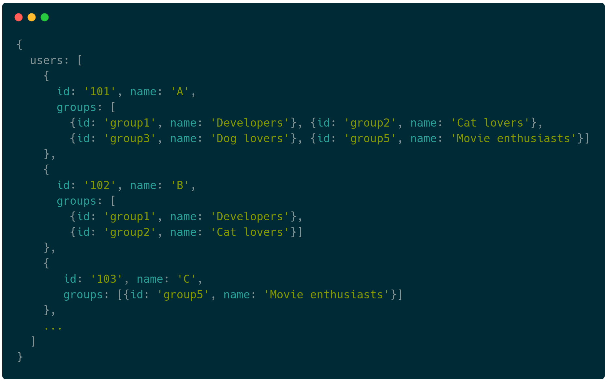
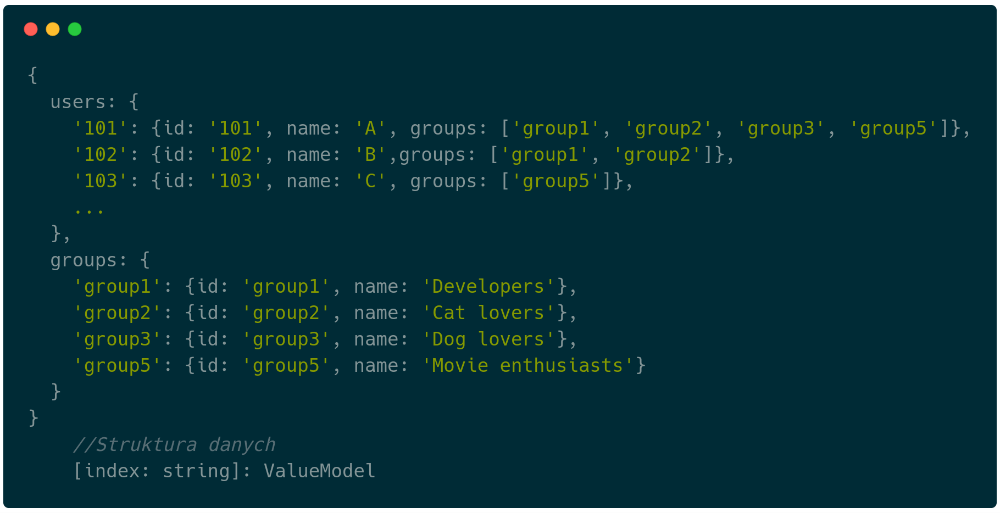
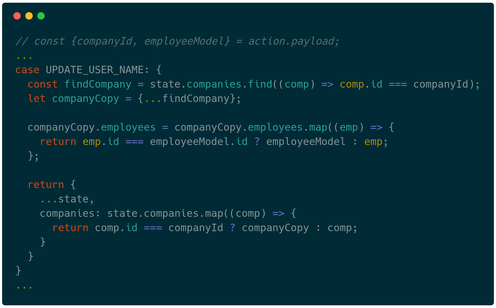
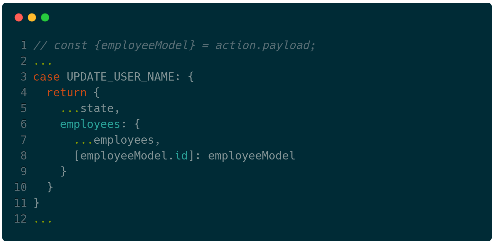
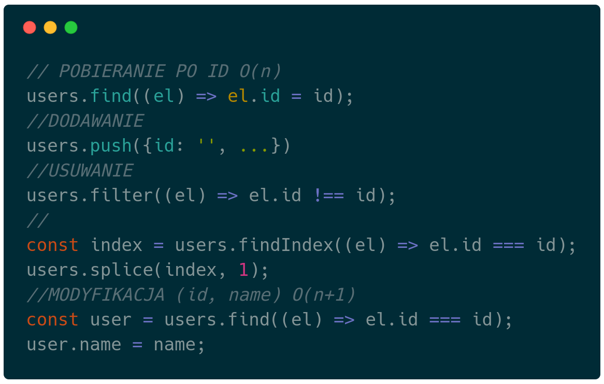

---?image=assets/image/first.jpg
### <span class="white">Redux state management</span>
---

## Stan aplikacji
```javascript
    global.state = {};
```
---
AGENDA
---
## Stan aplikacji

- Jest globalnym obiektem |
- Przepływ danych jasno określony (jednokierunkowy) |
- Reducery zapisują dane do stanu |
- Selektory pobierają dane ze stanu |
---

--- 
## Typy danych
- Backend API |
- Dane aplikacji |
- Przykład: Informacje o wybranej zakładce, informacje o danych routingu, paginacji | 
- Zachowanie aplikacji: Stan załadowania danych - loading/loaded, Wybrany element |
---
(OBRAZEK) ZAŁADOWANE DANE I PRZYKŁADOWY STAN (NESTED OBJECTS, NOT CATEGORIZED)
---
## Uporządkowanie stanu
- Grupowanie danych tego samego rodzaju |
- Ustanowienie relacji pomiędzy nimi |
- Usunięcie duplikacji |
- Normalizacja |
---
## Postać znormalizowana
- 1 postać normalna | 
- 2 posać normalna | 
- 3 postać normalna |
- 4, 5 (tylko w rozważaniach teoretycznych) |
---
## 1 postać normalna
(OPIS + PRZYKŁAD)
---
## 2 postać normalna
(OPIS + PRZYKŁAD)
---
## 3 postać normalna
(OPIS + PRZYKŁAD)
---
### Praktyczne zastosowanie ma postać 2
---

--- 

---
## Dlaczego znormalizowane
- Pozbywamy się duplikatów! |
- Pozbywamy się zagnieżdżonych struktur! |
---
## Zduplikowane dane 
- Zwiększanie zużycia pamięci |
- Zduplikowane dane === problemy z modyfikacją |
- Przykład: musimy pamiętać i aktualizować wszystkie miejsca duplikacji na raz... |
---
## Zagnieżdzone dane
- Nadmiarowe odświeżanie widoków | 
- Niepotrzebna złożoność struktura |
- Zniszczenie aktualnego stanu (immutability, predictability) |
---

---
## <p><span class="slide-title">Stan znormalizowany</span></p>

---
<p><span class="slide-title">Operacje na tablicy</span></p>

---
---?code=sample/go/server.go&lang=golang&title=Golang File

@[1,3-6](Present code found within any repo source file.)
@[8-18](Without ever leaving your slideshow.)
@[19-28](Using GitPitch code-presenting with (optional) annotations.)

---

@title[JavaScript Block]

<p><span class="slide-title">JavaScript Block</span></p>


@[1,2](You can present code inlined within your slide markdown too.)
@[9-17](Displayed using code-syntax highlighting just like your IDE.)
@[19-20](Again, all of this without ever leaving your slideshow.)

---?gist=onetapbeyond/494e0fecaf0d6a2aa2acadfb8eb9d6e8&lang=scala&title=Scala GIST

@[23](You can even present code found within any GitHub GIST.)
@[41-53](GIST source code is beautifully rendered on any slide.)
@[57-62](And code-presenting works seamlessly for GIST too, both online and offline.)

---

## Template Help

- [Code Presenting](https://github.com/gitpitch/gitpitch/wiki/Code-Presenting)
  + [Repo Source](https://github.com/gitpitch/gitpitch/wiki/Code-Delimiter-Slides), [Static Blocks](https://github.com/gitpitch/gitpitch/wiki/Code-Slides), [GIST](https://github.com/gitpitch/gitpitch/wiki/GIST-Slides) 
- [Custom CSS Styling](https://github.com/gitpitch/gitpitch/wiki/Slideshow-Custom-CSS)
- [Slideshow Background Image](https://github.com/gitpitch/gitpitch/wiki/Background-Setting)
- [Slide-specific Background Images](https://github.com/gitpitch/gitpitch/wiki/Image-Slides#background)
- [Custom Logo](https://github.com/gitpitch/gitpitch/wiki/Logo-Setting), [TOC](https://github.com/gitpitch/gitpitch/wiki/Table-of-Contents), and [Footnotes](https://github.com/gitpitch/gitpitch/wiki/Footnote-Setting)

---

## Go GitPitch Pro!

<br>
<div class="left">
    <i class="fa fa-user-secret fa-5x" aria-hidden="true"> </i><br>
    <a href="https://gitpitch.com/pro-features" class="pro-link">
    More details here.</a>
</div>
<div class="right">
    <ul>
        <li>Private Repos</li>
        <li>Private URLs</li>
        <li>Password-Protection</li>
        <li>Image Opacity</li>
        <li>SVG Image Support</li>
    </ul>
</div>

---

### Questions?

<br>

@fa[twitter gp-contact](@gitpitch)

@fa[github gp-contact](gitpitch)

@fa[medium gp-contact](@gitpitch)

---?image=assets/image/gitpitch-audience.jpg

@title[Download this Template!]

### <span class="white">Get your presentation started!</span>
### [Download this template @fa[external-link gp-download]](https://gitpitch.com/template/download/sunkist)

