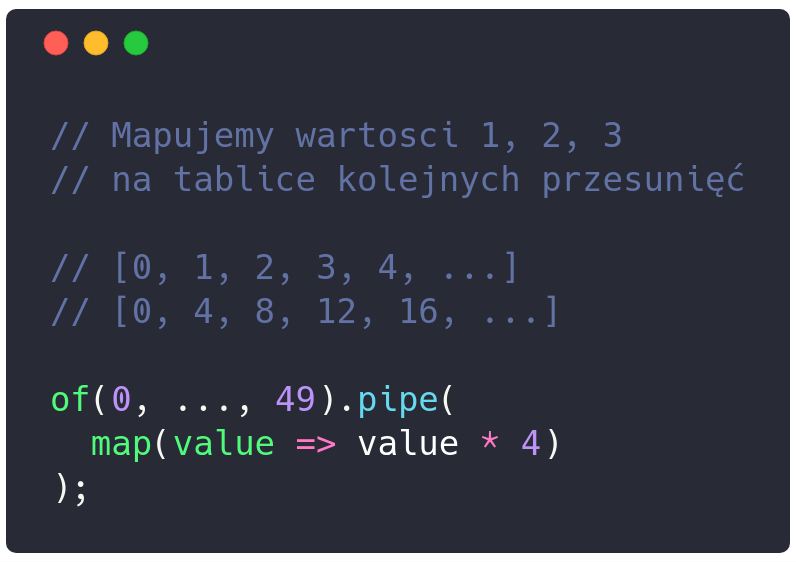
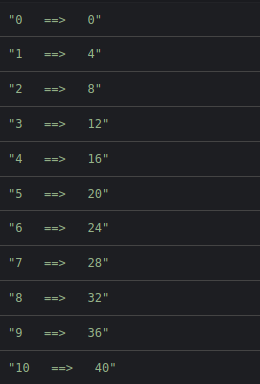

---?image=assets/image/first.jpg
### <span class="white">Observable - pipe</span>
---
### Plan prezentacji
- RxJS <= 5.4 |
- Dlaczego używać pipe |
- Migracja z v5 do v6 |
- Zastosowanie RxJS |
- Imperatywne vs Deklaratywne |
---
## RxJS <= 5.4
- Dot chaining |
- Patchowanie operatorów |
- Tworzenie operatorów |
- Importy |

## Migracja RxJS v5.x => v6
- Import paths
- Zmiana nazw operatorów |
- Operator pipe |
- rxjs-compat
---
## Import paths
```

```
---
+++ Imperatywne vs Deklaratywne
---
@snap[west half]

@snapend
@snap[east half]

@snapend
---
@snap[west left-70]

@snapend
@snap[east right-30]

@snapend
---
```typescript
of(1).pipe(
  map(() => this.createNewBall()),
  tap((component) => this.addToContainer(component)),
  switchMap((element: Vue) => {
    return interval(100).pipe(
      map(value => value * (containerHeight / steps),
      map((value: number) => ({element, value})),
      take(steps)
    )
  }),
).subscribe((params) => {
  params.element.$el.style.top = `${parameters.value}px`;
});
```
@[2-3](Tworzymy element HTML i dodajemy do kontenera)
@[4](Zaczynamy emitować wartość wewnętrzną)
@[5-9](Animacja wartości 0, 1, 2, 3)
@[9](Kończymy Observable po określonej ilości kroków)
@[12-14](Subskrybujemy się i podmieniamy style.top)
---

## [Redux structuring reducers @fa[external-link gp-download]](https://redux.js.org/recipes/structuring-reducers)
---
## Pytania

