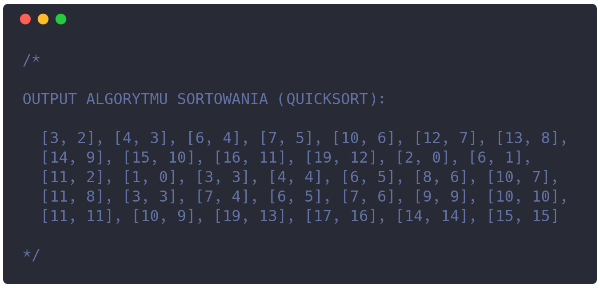
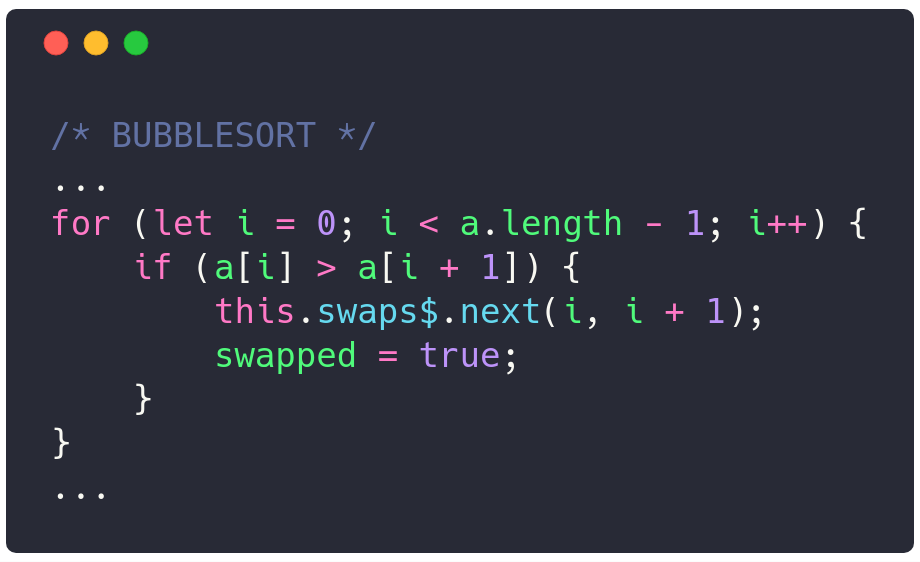

---?image=assets/image/first.jpg
### <span class="white">Observable - pipe</span>
---
### Plan prezentacji
- RxJS <= 5.4 |
- Dlaczego używać pipe |
- Migracja z v5 do v6 |
- Zastosowanie RxJS |
- Imperatywne vs Deklaratywne |
---
## RxJS <= 5.4
- Dot chaining |
- Patchowanie operatorów |
- Tworzenie operatorów |
- Importy |

## Migracja RxJS v5.x => v6
- Import paths
- Zmiana nazw operatorów |
- Operator pipe |
- rxjs-compat
---
## Import paths
```

```
---
### Programowanie: imperatywne vs deklaratywne
---
#### Podejście imperatywne
Wykonujemy sekwencję działań. Wprowadzamy <span class="orange">ciąg komend zmieniających stan</span> aplikacji w celu osiągnięcia pożądanego rezultatu.
---
### Podejście dekaratywne
Opisujemy rezultat działania naszego programu. <span class="orange">*Warunki jakie musi spełnić końcowe rozwiązanie (cel)</span> a nie szczegółową sekwencję kroków
kroków które do niego prowadzą*.
---
## Przykład
Chcemy pokazać zachowanie się operatorów wyższego rzędu poprzez wizualizację rzucenia piłki.
Po wybraniu operacji dynamicznie tworzymy nowy element HTML i wykonujemy animację spadającej piłki. Zachowanie rzucenia (wcisnięcia przycisku)
sterowane jest za pomocą operatorów switchMap, concatMap, mergeMap i exhaustMap.
---
@snap[west half]
<span style="font-size: 0.8em">
Chcemy pokazać zachowanie się operatorów wyższego rzędu poprzez wizualizację rzucenia piłki.
Po wybraniu operacji dynamicznie tworzymy <span class="orange">nowy element HTML</span> i wykonujemy <span class="orange">animację spadającej piłki</span>. Zachowanie rzucenia (wcisnięcia przycisku)
sterowane jest za pomocą operatorów <span class="orange">switchMap, concatMap, mergeMap i exhaustMap</span>.
</span>
@snapend
@snap[east half]

@snapend
---
@snap[west half half-text]
Funkcja <span class="orange">interval</span> emituje w *nieskończoność* kolejne
liczby naturalne co określony czas w ms (parametr).
@snapend
@snap[east half]

@snapend
---
@snap[west half]

@snapend
@snap[east half]

@snapend
---
@snap[west left-70]

@snapend
@snap[east right-30]

@snapend
---
```typescript
of(1).pipe(
  map(() => this.createNewBall()),
  tap((component) => this.addToContainer(component)),
  switchMap((element: Vue) => {
    return interval(100).pipe(
      map(value => value * (containerHeight / steps),
      map((value: number) => ({element, value})),
      take(steps)
    )
  }),
).subscribe((params) => {
  params.element.$el.style.top = `${params.value}px`;
});
```
@[2-3](Tworzymy element HTML i dodajemy do kontenera)
@[4](Zaczynamy emitować wartość wewnętrzną)
@[5-9](Animacja wartości 0, 1, 2, 3)
@[8](Kończymy Observable po określonej ilości kroków)
@[11-13](Subskrybujemy się i podmieniamy style.top)
---
@snap[west left-30]

@snapend
@snap[east right-60]

@snapend
---
@snap[west left-60]

@snapend
@snap[east right-40]

@snapend
---

---

---
## Parametryzowany operator

---
## [Operatory RxJS](https://rxjs-operators.firebaseapp.com)
---
## Przykład: Wizualizacja sortowania elementów
---
@snap[west left-60]
<span style="font-size: 0.8em; line-height: normal">
Chcemy przedstawić działanie algorytmów sortujących. Dla wybranego
algorytmu przedstawiamy <span class="orange">sekwencję</span> wykonywanych kroków jaką są
<span class="orange">zamiany dwóch elementów ze sobą</span> w odpowidniej kolejności. Chcemy <span class="orange">opóźnić kolejne kroki</span>
tak, żeby osoba oglądająca mogła zobaczyć zasadę działania.
</span>
@snapend
@snap[east right-40]

@snapend
---
## Podejście imperatywne
- Wykonujemy algorytm sortowania |
- Podczas działania algorytmu: |
- Dopóki tablica nieposortowana --> |
- Zamieniamy ze sobą dwa elementy |
- Uruchamiamy animację zamiany (setInterval, clearInterval) |
- Opóźniamy wykonanie następnego kroku |
---
@snap[west left-60]
W podejściu deklaratywnym skupiamy się na celu
jakim jest:
@ul[](false)
- <span class="orange">animacja zamiany dwóch elementów</span>
- opóźnienie wykonania
@ulend
Nie interesuje nas dostarczenie danych:
@ul[](false)
- kolejne kroki algorytmu
@ulend
@snapend
@snap[east right-40]

@snapend
---
## How to CSS? :(

---

---
@snap[west right-70]

@snapend
@snap[east left-20 half-text]
<span class="orange">value</span> to tablica [a, b] z dwoma indeksami do zamiany,
<span class="orange">time</span> to czas animacji.
@snapend
---
```typescript
    const SWAP_TIME = 5;
    this.swaps$.pipe(
        concatMap((value) => {
            return of(value).pipe(
                tap(swapTransition(value, SWAP_TIME)),
                mapTo(value),
                delay(SWAP_TIME * 1000)
            );
        }),
        takeUntile(this.end$)
    ).subscribe((value) => {
        const [a, b] = value;
        const temp = this.bars[a];
        this.bars[a] = this.bars[b]
        this.bars[b] = this.bars[a];
    });
```
@[1](Ustawiamy czas animacji)
@[2](Przyjmujemy dane ze strumienia)
@[5](Wykonujemy nasze swapTransition)
@[6](Mapujemy na [a, b])
@[7](Opóźniamy wykonanie następnego o czas animacji)
@[11-16](Teraz naprawdę podmieniamy dwa elementy ze sobą)
@[3](concatMap przyjmuje wartości w sekwencji czekając na wykonanie poprzedniej)
---
@snap[north]
Dostarczenie danych do Observable swaps$
@snapend
@snap[east right-50]

@snapend
@snap[west left-50]

@snapend
---
## [quicksort](https://quicksort-vis.firebaseapp.com)
## [bubblesort](https://sorting-f413d.firebaseapp.com)
---
## Pytania

