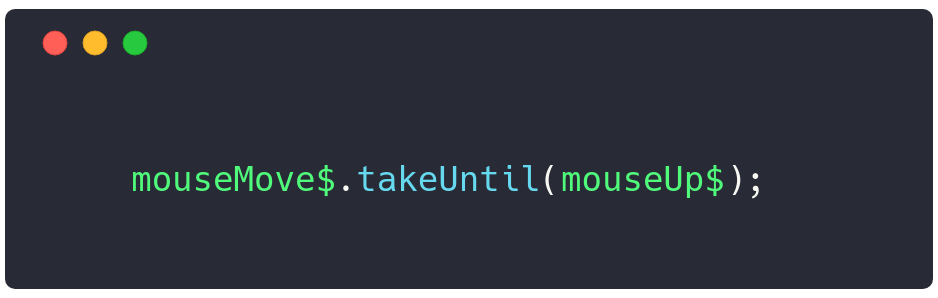
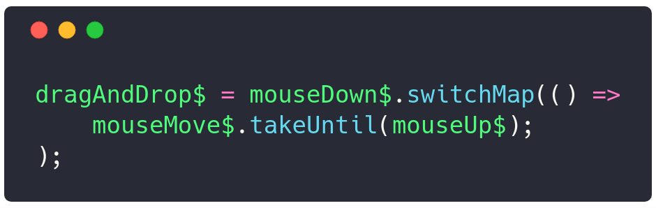

---?image=assets/image/first.jpg
### <span class="white">Observable - pipe</span>
---
### Plan prezentacji
- RxJS <= 5.4 |
- Dlaczego używać pipe |
- Migracja z v5 do v6 |
- Zastosowanie RxJS |
- Imperatywne vs Deklaratywne |
---
## RxJS <= 5.4
- Dot chaining |
- Patchowanie operatorów |
- Importy |
---
#### Wywoływanie kolejnych operatorów po kropce:
```
stream$
    .filter(value => ...)
    .debounceTime()
    .map(value => ...)
    .takeUntile(...)
```
---
#### Patchowanie Observable.prototype:
- Observable.prototype zawiera same deklaracje |
- każdy import to doklejanie ciała funkcji do Observable.prototype |
- ...globalnie! |
- ...co może powodować problemy |
---
```typescript
import {Observable} from 'rxjs';
```
Importujemy całą bibliotekę!!
(~ 1 MB, ~300kB po kompilacji)
---

---
#### Brak importu:
```
Error 'takeUntil is not a function'
```
---
#### Hint:

---
#### Rozwiązanie:

---
### Importy w v5.4 (patch)
```
import { Observable } from 'rxjs/Observable';
import 'rxjs/add/observable/of';
import 'rxjs/add/observable/interval';
import 'rxjs/add/operator/filter';
import 'rxjs/add/operator/switchMap';
```
---
### Importy w v5.5 (pipe)
```
import { interval } from 'rxjs/observable/interval';
import { of } from 'rxjs/observable/of';
import { filter } from 'rxjs/operators/filter';
import { switchMap } from 'rxjs/operators/switchMap';

interval(200).pipe(
    filter(...),
    switchMap(...)
).subscribe(value => console.log(value));
```
---
#### v5.5 === v5.4 + pipe
```
import { from } from 'rxjs/observable/from';
import { of } from 'rxjs/observable/of';
import 'rxjs/add/observable/from';
import 'rxjs/add/observable/of';
import { Observable } from 'rxjs/Observable';

Observable.of(...);
of(...);
Observable.from([...]);
```
---
### Importy w v6 (pipe)
```
import { Observable, Subject, pipe, interval, of } from 'rxjs';
import { filter, mergeMap } from 'rxjs/operators';

interval(200).pipe(
    filter(...),
    mergeMap(...)
).subscribe(value => console.log(value));
```
---
## Migracja RxJS v5.x => v6
---
### Zmiana nazw operatorów
Powód: zarezerwowane słowa
```
    do -> tap
    catch -> catchError
    switch -> switchAll
    finally -> finalize
```
---
#### Chaining vs Pipe
```
source
 .map(x => x + x)
 .mergeMap(n => of(n + 1, n + 2)
   .filter(x => x % 1 == 0)
   .scan((acc, x) => acc + x, 0)
 )
 .catch(err => of('error found'))
 .subscribe(printResult);
```
---
```
source.pipe(
 map(x => x + x),
 mergeMap(n => of(n + 1, n + 2).pipe(
   filter(x => x % 1 == 0),
   scan((acc, x) => acc + x, 0),
 )),
 catchError(err => of('error found')),
).subscribe(printResult);
```
---
#### Deklarowanie własnych operatorów
```
const pow => (power: number) =>
	(source$: Observable<number>) =>
		source$.pipe(map(n => n ** p));
```
---
#### ...i użycie operatora
```
source$.pipe(
    filter(x => x > 100),
    pow(3),
).subscribe(x => console.log(x));
```
---
## Programowanie: imperatywne vs deklaratywne
---
## Do czego RxJS?
- Łączenie ze sobą zdarzeń HTML (onclick, onkeyup, ...) |
- Dodawanie opóźnienia |
- Sterowanie asynchronicznymi wywołaniami |
- Ograniczenie wysyłania zdarzeń po stronie klienta (debounce, throttle) |
- Przetwarzanie danych w strumieniu async |
---
#### Podejście imperatywne
Wykonujemy sekwencję działań. Wprowadzamy <span class="orange">ciąg komend zmieniających stan</span> aplikacji w celu osiągnięcia pożądanego rezultatu.
---
### Podejście dekaratywne
Opisujemy rezultat działania naszego programu. <span class="orange">*Warunki jakie musi spełnić końcowe rozwiązanie (cel)</span> a nie szczegółową sekwencję
kroków które do niego prowadzą*.
---
### Deklaratywnie
- Zapytanie SQL opisujące wynik wykonania |
- Utworzenie komponentu HTML i wprowadzenie modelu danych |
- Wyrażenie regularne |
---
### Przykład: drag & drop
Dla każdego wcisnięcia przycisku myszy <span class="orange">(onmousedown)</span>
chcemy zacząć nasłuchiwać na przesunięcia <span class="orange">(onmousemove)</span> dopóki
przycisk myszy nie zostanie puszczony <span class="orange">(onmouseup)</span>.
---
@snap[west right-70]

@snapend
@snap[east left-20 half-text]
Zbieramy nasze zdarzenia z dokumentu za pomocą operatora <span class="orange">fromEvent</span>.
@snapend
---
@snap[west right-70]

@snapend
@snap[east left-20 half-text]
Nasłuchujemy na przesunięcia <span class="orange">mouseMove$</span> dopóki nie puścimy przycisku myszy <span class="orange">mouseUp$</span>.
---
@snap[west right-70]

@snapend
@snap[east left-20 half-text]
Na każde zdarzenie <span class="orange">mouseDown$</span> zaczynamy emitować wartości z <span class="orange">mouseMove$</span>.
---
### [d&d](https://codepen.io/marek-m/pen/JOWzXb?editors=1011)
---
## Przykład
Chcemy pokazać zachowanie się operatorów wyższego rzędu poprzez wizualizację rzucenia piłki.
Po wybraniu operacji dynamicznie tworzymy nowy element HTML i wykonujemy animację spadającej piłki. Zachowanie rzucenia (wcisnięcia przycisku)
sterowane jest za pomocą operatorów switchMap, concatMap, mergeMap i exhaustMap.
---
@snap[west half]
<span style="font-size: 0.8em">
Chcemy pokazać zachowanie się operatorów wyższego rzędu poprzez wizualizację rzucenia piłki.
Po wybraniu operacji dynamicznie tworzymy <span class="orange">nowy element HTML</span> i wykonujemy <span class="orange">animację spadającej piłki</span>. Zachowanie rzucenia (wcisnięcia przycisku)
sterowane jest za pomocą operatorów <span class="orange">switchMap, concatMap, mergeMap i exhaustMap</span>.
</span>
@snapend
@snap[east half]

@snapend
---
@snap[west half half-text]
Funkcja <span class="orange">interval</span> emituje w *nieskończoność* kolejne
liczby naturalne co określony czas w ms (parametr).
@snapend
@snap[east half]

@snapend
---
@snap[west half]

@snapend
@snap[east half]

@snapend
---
@snap[west left-70]

@snapend
@snap[east right-30]

@snapend
---
```typescript
of(1).pipe(
  map(() => this.createNewBall()),
  tap((component) => this.addToContainer(component)),
  switchMap((element: Vue) => {
    return interval(100).pipe(
      map(value => value * (containerHeight / steps),
      map((value: number) => ({element, value})),
      take(steps)
    )
  }),
).subscribe((params) => {
  params.element.$el.style.top = `${params.value}px`;
});
```
@[2-3](Tworzymy element HTML i dodajemy do kontenera)
@[4](Zaczynamy emitować wartość wewnętrzną)
@[5-9](Animacja wartości 0, 1, 2, 3)
@[8](Kończymy Observable po określonej ilości kroków)
@[11-13](Subskrybujemy się i podmieniamy style.top)
---
@snap[west left-30]

@snapend
@snap[east right-60]

@snapend
---
@snap[west left-60]

@snapend
@snap[east right-40]

@snapend
---

---

---
## Parametryzowany operator

---
## [Operatory RxJS](https://rxjs-operators.firebaseapp.com)
---
## Przykład: Wizualizacja sortowania elementów
---
@snap[west left-60]
<span style="font-size: 0.8em; line-height: normal">
Chcemy przedstawić działanie algorytmów sortujących. Dla wybranego
algorytmu przedstawiamy <span class="orange">sekwencję</span> wykonywanych kroków jaką są
<span class="orange">zamiany dwóch elementów ze sobą</span> w odpowidniej kolejności. Chcemy <span class="orange">opóźnić kolejne kroki</span>
tak, żeby osoba oglądająca mogła zobaczyć zasadę działania.
</span>
@snapend
@snap[east right-40]

@snapend
---
## Podejście imperatywne
- Wykonujemy algorytm sortowania |
- Podczas działania algorytmu: |
- Dopóki tablica nieposortowana --> |
- Zamieniamy ze sobą dwa elementy |
- Uruchamiamy animację zamiany (setInterval, clearInterval) |
- Opóźniamy wykonanie następnego kroku |
---
@snap[west left-60]
W podejściu deklaratywnym skupiamy się na celu
jakim jest:
@ul[](false)
- <span class="orange">animacja zamiany dwóch elementów</span>
- opóźnienie wykonania
@ulend
Nie interesuje nas dostarczenie danych:
@ul[](false)
- kolejne kroki algorytmu
@ulend
@snapend
@snap[east right-40]

@snapend
---
## How to CSS? :(

---

---
@snap[west right-70]

@snapend
@snap[east left-20 half-text]
<span class="orange">value</span> to tablica [a, b] z dwoma indeksami do zamiany,
<span class="orange">time</span> to czas animacji.
@snapend
---
```typescript
    const SWAP_TIME = 5;
    this.swaps$.pipe(
        concatMap((value) => {
            return of(value).pipe(
                tap(swapTransition(value, SWAP_TIME)),
                mapTo(value),
                delay(SWAP_TIME * 1000)
            );
        }),
        takeUntile(this.end$)
    ).subscribe((value) => {
        const [a, b] = value;
        const temp = this.bars[a];
        this.bars[a] = this.bars[b]
        this.bars[b] = this.bars[a];
    });
```
@[1](Ustawiamy czas animacji)
@[2](Przyjmujemy dane ze strumienia)
@[5](Wykonujemy nasze swapTransition)
@[6](Mapujemy na [a, b])
@[7](Opóźniamy wykonanie następnego o czas animacji)
@[11-16](Teraz naprawdę podmieniamy dwa elementy ze sobą)
@[3](concatMap przyjmuje wartości w sekwencji czekając na wykonanie poprzedniej)
---
@snap[north]
Dostarczenie danych do Observable swaps$
@snapend
@snap[east right-50]

@snapend
@snap[west left-50]

@snapend
---
## [quicksort](https://quicksort-vis.firebaseapp.com)
## [bubblesort](https://sorting-f413d.firebaseapp.com)
---
## Podsumowując (migracja)
- Migrując kod do wersji 6 pamiętamy o zmianie nazw niektórych funkcji |
- oraz usunięciu importów całej biblioteki. |
- pipe pozwala importować tylko te funkcje które chcemy wykorzystać |
- definiowanie własnych operatorów w prosty sposób |
---
## Podsumowując (deklaratywne)
- Dzielimy program na składowe/zależności |
- Określamy i opisujemy cel programu |
- ...i piszemy kod zaczynając od końca :) |
- Dostarczenie danych (początkowych obliczeń) potwierdza prawidłowe określenie końcowego rezultatu |
---
